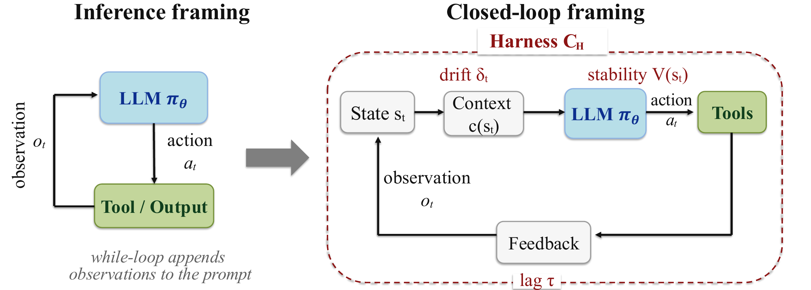
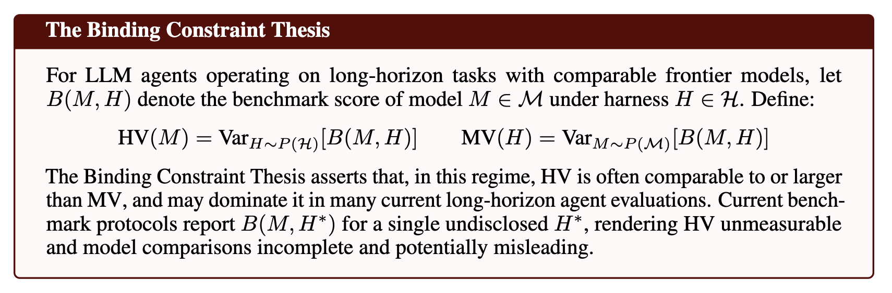

# Stop Comparing LLM Agents Without Disclosing the Harness

**Position paper:** [Stop Comparing LLM Agents Without Disclosing the Harness](Stop%20Comparing%20LLM%20Agents%20Without%20Disclosing%20the%20Harness.pdf)

**Authors:** Yunbei Zhang, Weijie Xu, Janet Wang, Jihun Hamm, Yingqiang Ge, Chandan K. Reddy

**Project page:** https://yunbeizhang.github.io/harness-binding-constraint/

## Position

Long-horizon LLM-agent benchmark scores are not properties of models alone. They
are jointly produced by the model and the execution harness around it: the
software layer that constructs context, mediates tools, validates outputs, logs
state, decides whether to retry, and determines when an agent stops.



The usual inference framing treats an agent as a model in a while-loop. We argue
that long-horizon agents are better understood as closed-loop systems: the model
is an open-loop policy, while the harness is the controller that determines
stability, context drift, feedback timing, recovery behavior, and tool-mediated
execution.

This closed-loop view leads to the **Binding Constraint Thesis**: when frontier
models are evaluated on long-horizon tasks, harness configuration can explain
more performance variance than model choice. In that regime, a leaderboard that
reports only `{model, benchmark, score}` risks attributing harness-level gains to
model capability.



Let `B(M, H)` denote the benchmark score of model `M` under harness `H`. The
paper separates two sources of variance:

```math
HV(M) = Var_{H \sim P(\mathcal{H})}[B(M, H)]
```

```math
MV(H) = Var_{M \sim P(\mathcal{M})}[B(M, H)]
```

The thesis asserts that, for many current long-horizon agent evaluations,
`HV` is often comparable to or larger than `MV`. When benchmark protocols report
only `B(M, H*)` for a single undisclosed harness `H*`, harness variance becomes
unmeasurable and model comparisons become incomplete.

## What Should Change

Agent evaluations should make the harness visible. In particular, benchmark
reports should include:

- a **Harness Card** describing execution, tools, context construction,
  scheduling, observability, verification, and governance;
- either a **locked-harness protocol**, where all models run under the same
  specified harness, or a **factorial protocol**, where harness choice is varied
  as an explicit experimental factor;
- trajectory-level metrics such as recovery rate, context retention, and control
  lag, so score changes can be attributed to model behavior, harness behavior,
  or their interaction.

Until those details are disclosed, long-horizon agent leaderboard comparisons
should be treated as incomplete and potentially misleading.
